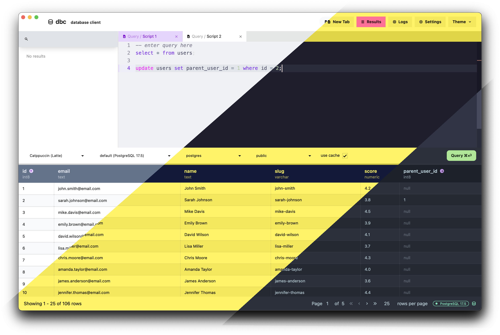

# dbc

A barebones SQL database client, written in Rust / Deno.



## Usage

This application uses a Rust server for the backend and a Deno / Vite / React
application for the frontend.

### Setup

Before running/building, make sure `curl` and `jq` are installed.

The frontend client needs to build/cache some assets for the editor themes and tree-sitter.
Use the included `build.sh` script to perform this setup:

```sh
$ cd client && ./build.sh
```

### Building

To run in development, you can start the server and FE client like so:

```sh
$ cd client && deno task dev
$ cd server && cargo run
```

You may also run the application in bundled mode, which uses tao / wry to run the
FE application in a webview embedded in a native window that feels like a native app.

To run in bundled mode, use the included `bundle.rs` script:

```sh
$ ./bundle.rs --dev
```

This will build the FE application and then start the backend service in bundled mode.

To build as a standalone application and install to your system `/Applications` directory,
use the `bundle.rs` script with the `--install` flag (the default behaviour).

```sh
$ ./bundle.rs --install
```

The application is built primarily for MacOS, but should work on other platforms in
non-bundled mode, and with minimal tweaks when bundled.

## Roadmap

- [x] Improved modal for parameter input
- [x] Improve autocomplete for join field names
- [x] Improve autocomplete by operating on query AST
- [x] Cache editor themes during build to improve launch times
- [-] Improve script-based password loading (real-time output, timeouts)
- [-] Support non-string data types for filtering
- [-] Standalone bundle distribution
- [ ] Improved first run experience
- [ ] Editor format command

## License

Published under the AGPLv3 license. &copy; 2025 Aaron Ross. All rights reserved.
